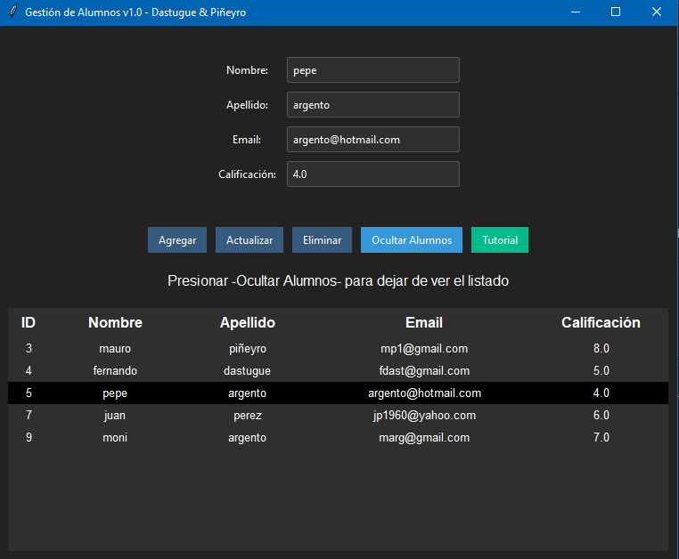

# Desktop App CRUD ALUMNOS:

Fue desarrollada con fines educativos, por Fernando Dastugue y Mauro Piñeyro, para el curso "Técnicas de Programación" del CFP N°23.

## Software empleado:

- _Python_
- _Tkinter_
- _ttk bootstrap_: Ejecutar -pip install ttkbootstrap- en la terminal para instalar.
- _SQLite_ (para la base de datos)

## Funcionalidad:

Esta app permite:

- Agregar alumnos a un curso.
- Eliminar alumnos del curso.
- Modificar datos de los alumnos guardados en la base de datos y actualizarlos.
- Mostrar una lista completa de los alumnos guardados.

## Interfaz Gráfica:

